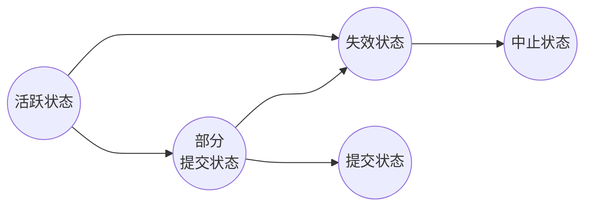

## 数据库设计
### 避免两个主要缺陷
- 冗余：信息重复
- 不完整：可能会使得企业的某些方面难以甚至无法建模
### 实体集
共享相同属性或性质的、具有相同类型的实体的集合
### 联系集
联系时多个实体间的关乎关联，相同类型联系的集合
### 复杂属性
- 简单和复合属性
  复合属性可以被有层次地划分为多个子部分
  ER图用tab
- 单值和多值属性
  {phone_number}
- 派生属性
  可以通过其他属性计算出来
  age()
### 双线
表示一个实体在联系集中全部参与
### 码
- 超码：一个或多个属性集合，可以唯一标识一个实体/元组
- 候选码：最小的超码
- 主码：设计者从候选码中选出唯一标识balahbalah
### 联系集主码选择
- 多对多
  主码的并集就是最小的超码
- 多对一、一对多
  多方的主码就是最小的超码
- 一对一
  任一一方的主码就是最小的超码
### 弱实体集、强实体集、标识性实体集、标识性联系集、分辨符属性
- 没有足够的属性唯一标识一个特定的实体
- 不是弱实体集的实体集
- 弱实体集的存在依赖的实体集
- ？
- 使用标识性实体集的主码以及分辨符属性唯一标识弱实体
### 转换为关系模式
- 复杂属性
  - 派生属性直接去掉
  - 多值属性多一张表出来
  - 复合属性细分原子化
- 联系集
  - 多对多需要转换为关系模式，主码并集+描述性属性
  - 多对一、一对一
    - 描述性属性很多，转换：多方的属性+描述性属性
    - 不转换：多方的表中加入一方的主码
  - 标识性联系集不能转换
### 常见错误
- P190
- P191
### n元联系集转换
至多出现一个箭头，否则会有歧义
变成二元联系集
## ER图
### 有损、无损分解
没有信息丢失的分解
$R_1 \cap R2 -> R_1$ or $R_1 \cap R2 -> R_2$
### 函数依赖
$\alpha \subseteq R \And \beta \subseteq R$，给定$r(R)$的一个实例，$\forall t_1, t_2 \in r(R)$，使得若$t_1[\alpha] = r_2[\alpha]$，则$t_1[\beta] = r_2[\beta]$成立，称该实例满足函数依赖$\alpha$->$\beta$
### 保持依赖分解
检查是否都满足F中的依赖，不做连接就能测试
### 码
若K->R在r(R)上成立，则K是r(R)的一个超码
若K->R在r(R)上成立，且K的任意真子集K'->R在r(R)上都不成立，则K是r(R)的一个候选码
### BCNF
$F^+$中所有$\alpha$->$\beta$以下至少一项成立
- $\alpha$->$\beta$平凡($\beta \subseteq \alpha$)
- $\alpha$是R的一个超码
### 3NF
$F^+$中所有$\alpha$->$\beta$以下至少一项成立
- $\alpha$->$\beta$平凡($\beta \subseteq \alpha$)
- $\alpha$是R的一个超码
- $\beta$-$\alpha$中的每个属性A都被包含于R的一个候选码中
### 设计目标
- BCNF
- 无损性
- 依赖保持性
### 逻辑蕴含
给定关系模式r(R)，如果r(R)的每一个满足F的实体也满足f，则R上的函数依赖f被R上的函数依赖集F所逻辑蕴含
### F闭包
被F所逻辑蕴含的所有函数依赖集合
### 属性闭包的用途
- 测试$\alpha$是否为超码
- 通过检查是否$\beta \subseteq \alpha^+$，检查$\alpha$->$\beta$是否成立
- 计算$F^+$
### 无关属性
去除函数依赖的一个属性而不改变函数依赖集的闭包，该属性为无关属性
考虑函数依赖集F以及F中的函数依赖$\alpha$->$\beta$
  - 从左侧移除：如果F逻辑蕴含$A \in \alpha$并且$(F-\{\alpha->\beta\} \cup \{(\alpha -A)->\beta\})$
  - 从右侧移除：如果$A \in \beta$并且$(F-\{\alpha->\beta\} \cup \{\alpha->(\beta-A)\})$逻辑蕴含F
### 正则覆盖
$F$逻辑蕴含$F_c$中的所有依赖，并且$F_c$逻辑蕴含$F$中的所有依赖
$F_c$中任何函数依赖都不包含无关属性
$F_c$中函数依赖左侧都是唯一的
## 索引
### 索引项/索引记录
由一个搜索码值和指针组成，这些指针指向具有该搜索码值的一条或多条记录，指针由磁盘块的标识和块内位移组成
- 稠密聚集索引\稀疏索引
  搜索码值以及指向具有该搜索码值得第一条记录得指针
### 顺序索引
按照排好的顺序存储搜索码的值，并将每个搜索码与包含该搜索码的记录关联起来
- 缺点
  - 随着文件增大，索引查找的性能和数据顺序扫描的性能都会下降
  - 虽然可以通过对文件的重新组织弥补，但不希望频繁地进行重组
### 聚集索引/主索引
搜索码定义了文件的次序
### 非聚集索引/辅助索引
搜索码指定的次序与文件的排列次序不同
一定要稠密索引每个都指向
提高了使用除了聚集索引的搜索码之外的码的搜索性能，但会给数据库带来很大开销
### 稠密索引
文件中的每个搜索码值都有一个索引项
可以比稀疏索引更快定位
### 稀疏索引
只为某些搜索码值建立索引项
一定要聚集索引按顺序
比稠密索引占用空间少，插入删除的维护开销较小
### 稠密索引和稀疏索引的折中
为每一块建一个索引项
开销主要由把块从磁盘中读入主存所花费的时间，在主存中扫描整个块可以忽略时间
块访问次数最小，索引规模尽可能小
### $B^+$树索引
采用平衡树结构，从树根到树叶的每条路径长度相同
增加文件插入和删除的性能开销和空间开销，但可以接受
孩子数量
  - 根任意个或2到n个孩子(指针)
  - 非叶节点$\lceil n/2 \rceil$到$n$个(指针)
  - 叶节点$\lceil (n-1)/2 \rceil$到$n$-1个(值)
### $B^+$树的查询
直到叶节点，找大于等于value的最小
- 找到
  - 等：去右边指针
  - 不等：左边指针
- 没找到：去最后一个指针
### 范围查询
查找搜索码值在特定区间内的所有记录
$B^+$树索引可以
散列索引不得
### B树
搜索码只出现一次
更少的树节点存储
扇出较少，更深
查找某些值更快，某些更慢
非叶节点中增加B指针域指向记录
### 散列索引
- 桶：存储一条或多条记录的的存储单元，可以是记录的链表或索引项
- K表示搜索码的集合，B表示所有桶地址的集合，散列函数h是从K到B的函数
- 哈希冲突
  - 闭寻址：溢出链表
  - 开寻址
- 桶没有足够的空间：桶溢出(不可避免)，使用溢出桶解决
- 偏斜：多条记录具有相同搜索码
### 位图索引
适合where后多个属性，且这些属性的值有限个
一个值对应一个位图，位图大小由记录个数决定
## 事务
### ACID
- 原子性
  事务的所有操作在数据库中要么全部正确反映，要么完全不反应
  恢复系统完成
  维护日志
- 一致性
  以隔离方式执行事务，以保持数据库的一致性
- 隔离性
  多个事务可能并发执行，但每个事务都感觉不到系统中有其他事务并发执行
  并发控制系统
- 持久性
  在一个事务成功完成后，对数据库的改变是永久的
    - 存储器
      - 易失性存储器：系统崩溃信息不会幸存
      - 非易失性存储器：系统崩溃后信息会幸存
      - 稳定存储器：永远不会丢失
    - 存储层次
      - Cache
      - 主存
      - 闪存
      - 磁盘
      - 光盘
      - 磁带
### 事务
是访问并可能更新各种数据项的一个程序执行单元
### 事务状态图
事务必须处于以下状态
- 活跃状态：初始状态，事务执行时就处于这种状态
- 部分提交状态，在最后一条语句执行之后
- 失效状态：发现正常执行不能再继续之后
- 中止状态：在事务已回滚并且数据库已被恢复到它在事务开始前的状态之后
- 提交状态：在成功完成之后

一个事务要么提交要么中止->终止的
### 并发的好处
- 提高吞吐量和资源利用率
- 减少等待时间
### 调度
事务中指令的一种执行顺序
### 冲突指令
I和J是不同事务在*相同数据项*执行的操作，至少一条指令是write，I和J冲突
### 冲突等价
S经过一系列非冲突指令的交换而转换成的调度S'，S和S'是冲突等价
### 串行调度
每个串行调度由来自各个事务的指令序列组成，其中属于一个单独事务的指令在该调度中是一起出现的
### 冲突可串行化
若一个调度S与一个串行调度冲突等价，称调度S是冲突可串行化的
### 调度优先图，有向图
有环就不是冲突可串行化